# Customer Analytics Dashboard

## Canteen Shop Customer Segmentation Analysis

A comprehensive interactive dashboard for customer analytics using RFM Analysis, Customer Lifetime Value (CLTV) calculation, and KMeans Clustering. This project provides actionable insights for customer retention, churn prevention, and revenue optimization.


---

## Table of Contents

- [Overview](#overview)
- [Process Flow Visualization](#process-flow-visualization)
- [Features](#features)
- [Three Core Insights](#three-core-insights)
- [Installation](#installation)
- [Usage](#usage)
- [Project Structure](#project-structure)
- [Methodology](#methodology)
- [Key Visualizations](#key-visualizations)
- [Business Recommendations](#business-recommendations)
- [Technologies Used](#technologies-used)
- [Contributing](#contributing)
- [License](#license)

---

## Overview

This project analyzes canteen shop transactional data to identify customer segments and provide data-driven business recommendations. By combining rule-based RFM segmentation with machine learning clustering (KMeans), the analysis validates customer groupings and enables targeted marketing strategies.

**Dataset**: Canteen shop transaction records including customer IDs, purchase dates, items, quantities, and prices.

**Goal**: Deliver three core actionable insights:
1. High-value customer profile and retention strategy
2. Churn risk quantification and win-back priority
3. Customer Lifetime Value (CLTV) analysis and Pareto principle validation

---

## Process Flow Visualization

Understanding how the dashboard analyzes data and generates insights:

### Simplified Analysis Pipeline

```mermaid
flowchart LR
    A[📁 Raw Data] --> B[🧹 Clean Data]
    B --> C[📊 RFM Analysis]
    B --> D[💰 CLTV Calculation]
    B --> E[🔍 KMeans Clustering]

    C --> F[🎯 3 Core Insights]
    D --> F
    E --> F

    F --> G[📈 7 Visualizations]
    G --> H[💡 Business Actions]
    H --> I[🚀 Interactive Dashboard]

    style A fill:#e3f2fd
    style B fill:#fff3e0
    style C fill:#f3e5f5
    style D fill:#e8f5e9
    style E fill:#fce4ec
    style F fill:#fff9c4
    style G fill:#e0f2f1
    style H fill:#ffe0b2
    style I fill:#c8e6c9
```



### Three Core Insights Flow

```mermaid
flowchart TD
    Data[📊 Cleaned Data] --> RFM[RFM Analysis]
    Data --> CLTV[CLTV Calculation]
    Data --> KMeans[KMeans Clustering]

    RFM --> I1[💎 Insight 1:<br/>High-Value Profile<br/>Champions + VIP]
    KMeans --> I1

    RFM --> I2[⚠️ Insight 2:<br/>Churn Risk<br/>At Risk + Low Engagement]
    KMeans --> I2

    CLTV --> I3[💰 Insight 3:<br/>CLTV & Pareto<br/>80/20 Principle]

    I1 --> Actions[🎯 Business Actions]
    I2 --> Actions
    I3 --> Actions

    Actions --> A1[Retention: VIP Programs]
    Actions --> A2[Win-Back: Discounts]
    Actions --> A3[Growth: Upsell/Cross-sell]
    Actions --> A4[Budget: 50/30/15/5 Split]

    style I1 fill:#e8f5e9
    style I2 fill:#fff3e0
    style I3 fill:#e1f5fe
    style Actions fill:#f3e5f5
```



**📖 For complete process flow diagrams**, see [docs/process_flow.md](docs/process_flow.md) including:
- Complete analysis pipeline with all steps
- Data flow architecture
- Key metrics calculation flow
- Technology stack diagram

---

## Features

### Interactive Dashboard
- **6 Analysis Sections**: Executive Summary, RFM Analysis, CLTV Analysis, KMeans Clustering, Comparative Analysis, and Business Recommendations
- **Dynamic Visualizations**: 15+ interactive charts and heatmaps
- **Real-time Metrics**: Customer counts, revenue totals, and segment distributions
- **Responsive Design**: Optimized for desktop and mobile viewing

### Advanced Analytics
- **RFM Segmentation**: Rule-based customer classification (Champions, Loyal, At Risk, Lost, etc.)
- **CLTV Calculation**: Forward-looking customer value prediction
- **KMeans Clustering**: Data-driven segmentation with optimal k selection
- **Pareto Analysis**: Revenue concentration and 80/20 rule validation

### Business Intelligence
- **Actionable Insights**: Specific recommendations for each customer segment
- **ROI Projections**: Expected outcomes and revenue impact estimates
- **Budget Allocation**: CAC recommendations based on CLTV
- **Implementation Timeline**: Phased approach with milestones

---

## Three Core Insights

### 1. High-Value Customer Profile and Retention Strategy

**Key Segments**: Champions (RFM) and VIP Champions (KMeans Cluster)

**Characteristics**:
- Lowest recency (most recent purchases)
- Highest frequency (most purchases)
- Highest monetary value (largest spend)
- Most stable and profitable revenue stream

**Recommended Action**: **Retention & Loyalty Focus**
- Provide VIP treatment and exclusive offers
- Implement loyalty rewards programs
- Prevent churn through personalized engagement

**Expected Outcome**: Maintain 95%+ retention rate, increase lifetime value by 15-20%

---

### 2. Churn Risk Quantification and Win-Back Priority

**Key Segments**: At Risk (RFM) and Low Engagement (KMeans Cluster)

**Characteristics**:
- High recency (long time since last purchase)
- Historically high frequency/monetary value
- Valuable customers on verge of becoming "Lost"

**Recommended Action**: **Implement Win-Back Campaigns**
- Launch targeted email campaigns with special discounts
- Send personalized "We miss you" messages
- Survey to understand disengagement reasons
- Create urgency with limited-time offers

**Expected Outcome**: Recover 30-40% of at-risk customers, generate significant recovered revenue

---

### 3. Customer Lifetime Value (CLTV) and Pareto Principle

**Key Metrics**:
- **Total CLTV**: Quantifies total customer base worth
- **Average CLTV**: Sets acquisition cost targets
- **Pareto Distribution**: Validates revenue concentration

**Findings**:
- Top 20% of customers typically account for 70-80% of total CLTV
- Clear justification for prioritizing high-value segments
- Data-driven budget allocation for marketing spend

**Recommended Action**: **Strategic Resource Allocation**
- Set maximum CAC at 30% of average CLTV
- Allocate 50% of budget to Champion/VIP retention
- Prioritize top-tier customers identified by both RFM and KMeans

**Expected Outcome**: Optimized marketing ROI, improved customer acquisition efficiency

---

## Installation

### Prerequisites
- Python 3.8 or higher
- pip package manager
- Git

### Step 1: Clone the Repository

```bash
git clone https://github.com/horacefonseca/customer_analytics.git
cd customer_analytics
```

### Step 2: Install Dependencies

```bash
pip install -r requirements.txt
```

### Step 3: Verify Data File

Ensure `data/canteen_shop_data.csv` exists in the project directory.

---

## Usage

### Running the Streamlit App Locally

```bash
streamlit run app.py
```

The dashboard will open in your default browser at `http://localhost:8501`

### Running the Jupyter Notebook

```bash
jupyter notebook notebooks/canteen_sales_analysis.ipynb
```

---

## Project Structure

```
customer_analytics/
│
├── app.py                          # Main Streamlit application
├── requirements.txt                # Python dependencies
├── README.md                       # Project documentation
├── .gitignore                      # Git ignore file
│
├── data/
│   └── canteen_shop_data.csv      # Canteen transaction dataset
│
├── notebooks/
│   └── canteen_sales_analysis.ipynb  # Jupyter notebook version of analysis
│
└── docs/
    └── (additional documentation)
```

---

## Methodology

### 1. Data Cleaning
- Remove transactions with negative quantities (returns)
- Filter out zero or negative prices
- Calculate total transaction value (Quantity × Price)
- Handle missing customer IDs

### 2. RFM Analysis

**Recency**: Days since last purchase (lower is better)
```python
Recency = Snapshot_Date - Last_Purchase_Date
```

**Frequency**: Number of transactions (higher is better)
```python
Frequency = Count of unique transactions per customer
```

**Monetary**: Total spend (higher is better)
```python
Monetary = Sum of all transaction values per customer
```

**Scoring**: Each metric scored 1-5 (or 1-3 for Monetary based on distribution)
- Combined RFM score determines segment classification
- 8 predefined segments: Champions, Loyal Customers, Potential Loyalists, Recent Customers, At Risk, Can't Lose Them, Lost, Others

### 3. CLTV Calculation

```python
CLTV = Average_Order_Value × Purchase_Frequency × Customer_Lifespan_Years
```

**Components**:
- `Average_Order_Value = Total_Revenue / Num_Purchases`
- `Purchase_Frequency = (Num_Purchases / Customer_Lifespan_Days) × 365`
- `Customer_Lifespan_Years = (Last_Date - First_Date + 1) / 365`

### 4. KMeans Clustering

**Feature Preparation**:
- Log transformation of Monetary values (handle skewness)
- StandardScaler normalization (mean=0, std=1)

**Optimal K Selection**:
- Elbow method: Plot inertia for K=2 to K=10
- Identified optimal K=4 based on elbow curve

**Cluster Naming**:
- VIP Champions: High Frequency + High Monetary
- Recent Big Spenders: Low Recency + High Monetary
- Low Engagement: Low Frequency + Low Monetary
- Regular Customers: Moderate across metrics

### 5. Validation

**Convergence Analysis**:
- Cross-tabulation of RFM segments vs KMeans clusters
- High alignment confirms robust segmentation
- Both methods identify similar high-value and at-risk groups

---

## Key Visualizations

The dashboard includes 7 essential visualizations as per the deployment rubric:

### 1. Customer Segments Distribution (Bar Chart)
- Shows count and percentage of customers in each RFM segment
- Primary metric for segment sizing

### 2. Segment Metric Heatmap
- Compares normalized average Recency, Frequency, and Monetary across RFM segments
- Clearly highlights profile of each group

### 3. Revenue by KMeans Cluster (Bar Chart)
- Displays total revenue contributed by each KMeans cluster
- Identifies most economically valuable clusters

### 4. Cumulative CLTV Distribution (Pareto Line Chart)
- Shows cumulative % of CLTV vs cumulative % of customers
- Validates the 80/20 rule

### 5. CLTV Distribution (Histogram)
- Provides overall spread of CLTV values
- Shows mean and median CLTV for acquisition targets

### 6. Recency vs Log(Monetary) Scatter Plot
- Maps entire customer base onto two-dimensional action space
- Color-coded by KMeans cluster
- Quadrant analysis: Low R/High M = Retain; High R/Low M = Let Go

### 7. RFM Segments vs KMeans Clusters (Heatmap Cross-Tabulation)
- Shows count of customers in each combination of RFM segment and KMeans cluster
- Confirms alignment between rule-based and data-driven methods

---

## Business Recommendations

### Priority 1: Retain Champions and VIP Customers

**Actions**:
- Implement VIP loyalty program with exclusive benefits
- Provide priority customer service
- Personalized communications and rewards
- Quarterly satisfaction check-ins
- Referral incentives

**Expected Impact**: 95%+ retention, 15-20% CLTV increase

---

### Priority 2: Win-Back At-Risk and Low Engagement Customers

**Actions**:
- Targeted email campaigns with 20-30% discounts
- Personalized "We miss you" messages
- Customer surveys to understand disengagement
- Limited-time exclusive offers
- Re-onboarding programs

**Expected Impact**: 30-40% recovery rate, significant revenue recapture

---

### Priority 3: Grow Loyal and Regular Customers

**Actions**:
- Upsell and cross-sell campaigns
- Bundle offers to increase AOV
- Subscription models for frequency boost
- Educational content on complementary products
- Gamification and engagement programs

**Expected Impact**: 10-15% AOV increase, 20% frequency boost

---

### Budget Allocation (Based on CLTV)

- **50%** - Champion/VIP Retention
- **30%** - At-Risk Win-Back Campaigns
- **15%** - Loyal Customer Growth
- **5%** - Experimental New Customer Acquisition

**CAC Recommendations**:
- Max CAC: 30% of average CLTV
- Champions CAC tolerance: 50% of CLTV
- Regular customers CAC: 20% of CLTV

---

## Technologies Used

### Core Libraries
- **Streamlit** (1.28.0): Interactive web dashboard framework
- **Pandas** (2.0.3): Data manipulation and analysis
- **NumPy** (1.24.3): Numerical computing
- **Matplotlib** (3.7.2): Static visualizations
- **Seaborn** (0.12.2): Statistical data visualization
- **Scikit-learn** (1.3.0): Machine learning (KMeans, StandardScaler)

### Analysis Techniques
- **RFM Analysis**: Rule-based customer segmentation
- **K-Means Clustering**: Unsupervised machine learning
- **Elbow Method**: Optimal cluster selection
- **Pareto Analysis**: 80/20 principle validation
- **CLTV Modeling**: Customer value prediction

---

## Deployment

### Streamlit Cloud

1. Push code to GitHub repository
2. Go to [Streamlit Cloud](https://streamlit.io/cloud)
3. Connect your GitHub account
4. Select repository: `horacefonseca/customer_analytics`
5. Set main file path: `app.py`
6. Deploy

**Live URL**: (Will be generated after deployment)

---

## Contributing

Contributions are welcome! Please follow these steps:

1. Fork the repository
2. Create a feature branch (`git checkout -b feature/AmazingFeature`)
3. Commit your changes (`git commit -m 'Add some AmazingFeature'`)
4. Push to the branch (`git push origin feature/AmazingFeature`)
5. Open a Pull Request

---

## License

This project is licensed under the MIT License. See `LICENSE` file for details.

---

## Contact

**Project Maintainer**: Horace Fonseca

**GitHub**: [https://github.com/horacefonseca/customer_analytics](https://github.com/horacefonseca/customer_analytics)

---

## Acknowledgments

- Dataset: Canteen shop transactional data
- Inspired by industry-standard customer analytics frameworks
- Built with Streamlit for interactive data applications

---

## Screenshots

### Executive Summary


### RFM Analysis


### CLTV Analysis


### KMeans Clustering


*(Screenshots to be added after deployment)*

---

## Version History

- **v1.0.0** (2025-10-30): Initial release
  - Complete RFM, CLTV, and KMeans analysis
  - Interactive Streamlit dashboard
  - 7 essential visualizations
  - Business recommendations and action plan

---

**Built with ❤️ using Streamlit and Python**
