# Customer Analytics Dashboard - Process Flow

## Complete Analysis Pipeline

```mermaid
flowchart TD
    Start([📊 Start: Load Data]) --> Load[Load canteen_shop_data.csv]
    Load --> Clean{Data Cleaning}

    Clean --> Clean1[Remove negative quantities]
    Clean --> Clean2[Remove zero/negative prices]
    Clean --> Clean3[Calculate TotalPrice = Qty × Price]

    Clean1 --> CleanDone[Clean Dataset Ready]
    Clean2 --> CleanDone
    Clean3 --> CleanDone

    CleanDone --> Branch{Split Analysis Path}

    %% RFM Analysis Branch
    Branch --> RFM[RFM Analysis]
    RFM --> RFM1[Calculate Recency<br/>Days since last purchase]
    RFM --> RFM2[Calculate Frequency<br/>Number of transactions]
    RFM --> RFM3[Calculate Monetary<br/>Total spend]

    RFM1 --> RFMScore[Generate RFM Scores<br/>R: 1-5, F: 1-5, M: 1-3]
    RFM2 --> RFMScore
    RFM3 --> RFMScore

    RFMScore --> RFMSeg[Segment Customers<br/>Champions, Loyal, At Risk, Lost, etc.]

    %% CLTV Analysis Branch
    Branch --> CLTV[CLTV Analysis]
    CLTV --> CLTV1[Calculate Avg Order Value<br/>Revenue / Purchases]
    CLTV --> CLTV2[Calculate Purchase Frequency<br/>Purchases / Lifespan × 365]
    CLTV --> CLTV3[Calculate Customer Lifespan<br/>Last Date - First Date]

    CLTV1 --> CLTVCalc[CLTV = AOV × Frequency × Lifespan]
    CLTV2 --> CLTVCalc
    CLTV3 --> CLTVCalc

    CLTVCalc --> CLTVSeg[Segment by Value<br/>Low, Medium, High, Top Value]

    %% KMeans Clustering Branch
    Branch --> KMeans[KMeans Clustering]
    KMeans --> KM1[Prepare Features<br/>RFM metrics]
    KM1 --> KM2[Log Transform Monetary<br/>Handle skewness]
    KM2 --> KM3[StandardScaler<br/>Normalize features]
    KM3 --> KM4[Elbow Method<br/>Find optimal K]
    KM4 --> KM5[Apply KMeans K=4<br/>Generate clusters]
    KM5 --> KM6[Name Clusters<br/>VIP Champions, Low Engagement, etc.]

    %% Convergence
    RFMSeg --> Merge[Merge All Analyses]
    CLTVSeg --> Merge
    KM6 --> Merge

    Merge --> Validate[Cross-Validation<br/>RFM vs KMeans Convergence]

    %% Insight Generation
    Validate --> Insight1{Insight 1:<br/>High-Value Customers}
    Insight1 --> I1Detail[Champions + VIP Champions<br/>Low Recency, High F&M<br/>Action: Retention Strategy]

    Validate --> Insight2{Insight 2:<br/>Churn Risk}
    Insight2 --> I2Detail[At Risk + Low Engagement<br/>High Recency, Historic Value<br/>Action: Win-Back Campaigns]

    Validate --> Insight3{Insight 3:<br/>CLTV & Pareto}
    Insight3 --> I3Detail[Total & Avg CLTV<br/>80/20 Revenue Concentration<br/>Action: Budget Allocation]

    %% Visualizations
    I1Detail --> Viz[Generate Visualizations]
    I2Detail --> Viz
    I3Detail --> Viz

    Viz --> Viz1[📊 Customer Segments Bar Chart]
    Viz --> Viz2[🔥 Segment Metric Heatmap]
    Viz --> Viz3[💰 Revenue by Cluster]
    Viz --> Viz4[📈 Cumulative CLTV Pareto]
    Viz --> Viz5[📊 CLTV Distribution]
    Viz --> Viz6[🎯 Recency vs Monetary Scatter]
    Viz --> Viz7[🔄 RFM vs KMeans Cross-tab]

    %% Business Recommendations
    Viz1 --> Biz[Business Recommendations]
    Viz2 --> Biz
    Viz3 --> Biz
    Viz4 --> Biz
    Viz5 --> Biz
    Viz6 --> Biz
    Viz7 --> Biz

    Biz --> Rec1[Priority 1: Retain Champions<br/>VIP programs, loyalty rewards]
    Biz --> Rec2[Priority 2: Win-Back At-Risk<br/>Discounts, re-engagement]
    Biz --> Rec3[Priority 3: Grow Loyal<br/>Upsell, cross-sell]
    Biz --> Rec4[Budget: 50% Retention<br/>30% Win-Back, 15% Growth, 5% Acquisition]

    Rec1 --> Dashboard([🎯 Interactive Dashboard])
    Rec2 --> Dashboard
    Rec3 --> Dashboard
    Rec4 --> Dashboard

    style Start fill:#e1f5ff
    style Dashboard fill:#e1f5ff
    style Insight1 fill:#fff4e1
    style Insight2 fill:#ffe1e1
    style Insight3 fill:#e1ffe1
    style RFMSeg fill:#f0e1ff
    style CLTVSeg fill:#ffe1f0
    style KM6 fill:#e1f0ff
    style Biz fill:#fff9e1
```



---

## Simplified Process Flow

```mermaid
flowchart LR
    A[📁 Raw Data] --> B[🧹 Clean Data]
    B --> C[📊 RFM Analysis]
    B --> D[💰 CLTV Calculation]
    B --> E[🔍 KMeans Clustering]

    C --> F[🎯 3 Core Insights]
    D --> F
    E --> F

    F --> G[📈 7 Visualizations]
    G --> H[💡 Business Actions]
    H --> I[🚀 Interactive Dashboard]

    style A fill:#e3f2fd
    style B fill:#fff3e0
    style C fill:#f3e5f5
    style D fill:#e8f5e9
    style E fill:#fce4ec
    style F fill:#fff9c4
    style G fill:#e0f2f1
    style H fill:#ffe0b2
    style I fill:#c8e6c9
```



---

## Data Flow Architecture


---

## Key Metrics Flow

```mermaid
flowchart TD
    subgraph Metrics["📊 KEY METRICS CALCULATION"]
        direction LR

        subgraph RFM["RFM Metrics"]
            R[Recency<br/>Snapshot - Last Purchase]
            F[Frequency<br/>Count Transactions]
            M[Monetary<br/>Sum Revenue]
        end

        subgraph CLTV["CLTV Components"]
            AOV[Avg Order Value<br/>Revenue / Purchases]
            PF[Purchase Frequency<br/>Purchases / Days × 365]
            LS[Lifespan Years<br/>Days / 365]
            CLTVCalc[CLTV = AOV × PF × LS]

            AOV --> CLTVCalc
            PF --> CLTVCalc
            LS --> CLTVCalc
        end

        subgraph KM["KMeans Features"]
            Scale[StandardScaler<br/>Normalize RFM]
            Log[Log Transform<br/>Monetary]
            Cluster[K=4 Clusters<br/>VIP, Regular, Low, Big Spenders]

            Scale --> Cluster
            Log --> Cluster
        end
    end

    subgraph Segments["👥 CUSTOMER SEGMENTS"]
        S1[Champions<br/>R↑ F↑ M↑]
        S2[Loyal Customers<br/>R↑ F+ M+]
        S3[At Risk<br/>R↓ F+ M+]
        S4[Lost<br/>R↓ F↓ M↓]
    end

    subgraph Actions["🎯 BUSINESS ACTIONS"]
        A1[Retention<br/>VIP Programs]
        A2[Upsell<br/>Cross-sell]
        A3[Win-Back<br/>Discounts]
        A4[Let Go<br/>Minimal Investment]
    end

    R --> S1
    F --> S1
    M --> S1

    R --> S2
    F --> S2
    M --> S2

    R --> S3
    F --> S3
    M --> S3

    R --> S4
    F --> S4
    M --> S4

    S1 --> A1
    S2 --> A2
    S3 --> A3
    S4 --> A4

    style S1 fill:#c8e6c9
    style S2 fill:#fff9c4
    style S3 fill:#ffccbc
    style S4 fill:#ffcdd2
    style A1 fill:#a5d6a7
    style A2 fill:#fff59d
    style A3 fill:#ffab91
    style A4 fill:#ef9a9a
```



---

## 3 Core Insights Generation

```mermaid
flowchart TD
    subgraph Data["📊 ANALYZED DATA"]
        RFM[(RFM Segments)]
        CLTV[(CLTV Values)]
        Clusters[(KMeans Clusters)]
    end

    subgraph Insight1["💎 INSIGHT 1: HIGH-VALUE PROFILE"]
        direction TB
        Filter1[Filter: Champions + VIP]
        Metric1[Metrics:<br/>Low Recency<br/>High Frequency<br/>High Monetary]
        Action1[🎯 Action: RETENTION<br/>VIP programs<br/>Loyalty rewards<br/>Exclusive offers]
        Impact1[📈 Impact:<br/>95%+ retention<br/>15-20% CLTV increase]

        Filter1 --> Metric1 --> Action1 --> Impact1
    end

    subgraph Insight2["⚠️ INSIGHT 2: CHURN RISK"]
        direction TB
        Filter2[Filter: At Risk + Low Engagement]
        Metric2[Metrics:<br/>High Recency<br/>Historic High Value<br/>Declining Activity]
        Action2[🎯 Action: WIN-BACK<br/>Special discounts<br/>Re-engagement emails<br/>Surveys]
        Impact2[📈 Impact:<br/>30-40% recovery<br/>Significant revenue recapture]

        Filter2 --> Metric2 --> Action2 --> Impact2
    end

    subgraph Insight3["💰 INSIGHT 3: CLTV & PARETO"]
        direction TB
        Calc3[Calculate:<br/>Total CLTV<br/>Avg CLTV<br/>CLTV Distribution]
        Analysis3[Analysis:<br/>Pareto Chart<br/>Top 20% → 70-80% value]
        Action3[🎯 Action: BUDGET ALLOCATION<br/>Set CAC = 30% CLTV<br/>50% retention budget<br/>30% win-back budget]
        Impact3[📈 Impact:<br/>Optimized ROI<br/>Efficient acquisition]

        Calc3 --> Analysis3 --> Action3 --> Impact3
    end

    RFM --> Filter1
    Clusters --> Filter1

    RFM --> Filter2
    Clusters --> Filter2

    CLTV --> Calc3

    Impact1 --> Dashboard[🚀 Interactive Dashboard]
    Impact2 --> Dashboard
    Impact3 --> Dashboard

    style Insight1 fill:#e8f5e9
    style Insight2 fill:#fff3e0
    style Insight3 fill:#e1f5fe
    style Dashboard fill:#f3e5f5
```



---

## Technology Stack Flow

```mermaid
flowchart LR
    subgraph Frontend["🎨 FRONTEND"]
        ST[Streamlit<br/>Interactive UI]
        MPL[Matplotlib<br/>Static Plots]
        SNS[Seaborn<br/>Statistical Viz]
    end

    subgraph Backend["⚙️ BACKEND"]
        PD[Pandas<br/>Data Processing]
        NP[NumPy<br/>Numerical Computing]
        SKL[Scikit-learn<br/>ML Clustering]
    end

    subgraph Data["💾 DATA"]
        CSV[canteen_shop_data.csv]
    end

    subgraph Deploy["☁️ DEPLOYMENT"]
        GH[GitHub Repository]
        SC[Streamlit Cloud]
    end

    CSV --> PD
    PD --> NP
    NP --> SKL
    SKL --> ST
    PD --> MPL
    MPL --> SNS
    SNS --> ST

    ST --> GH
    GH --> SC
    SC --> User[👤 End User]

    style ST fill:#ff6b6b
    style PD fill:#4ecdc4
    style SKL fill:#95e1d3
    style SC fill:#38ada9
```



---

## Usage Instructions

To view these diagrams:

1. **GitHub**: Diagrams render automatically in the GitHub repository
2. **VS Code**: Install "Markdown Preview Mermaid Support" extension
3. **Online**: Copy code to https://mermaid.live for interactive editing
4. **Documentation**: These diagrams are now part of the project docs

## Integration

Add this to your README.md:

```markdown
## 📊 Process Flow Visualization

See our complete [Process Flow Documentation](docs/process_flow.md) for detailed diagrams showing:
- Complete analysis pipeline
- Data flow architecture
- Key metrics calculation
- 3 core insights generation
- Technology stack
```
